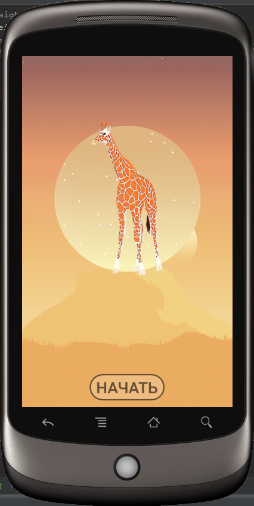
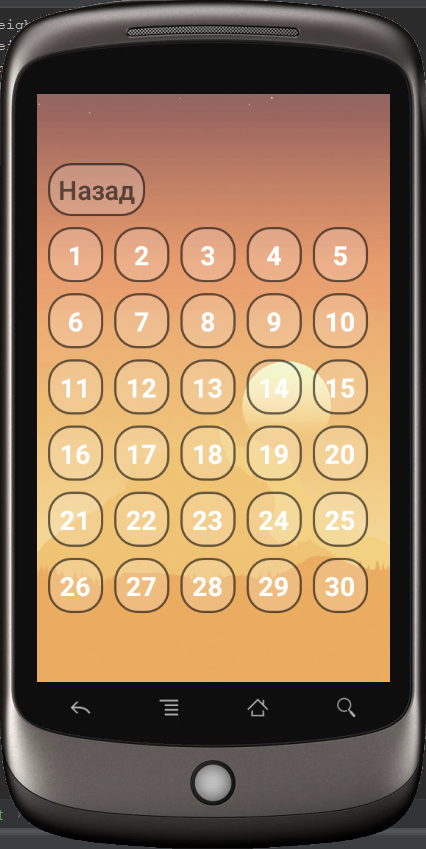
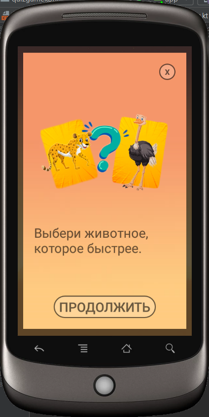
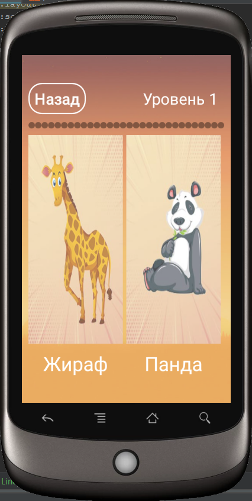

# QuizGameKotlin - Викторина про животных на Kotlin

Викторина про животных для Android устройств версии 4.4.2 (KitKat) и выше, написанная исключительно на Kotlin
* Главный экран с выбором иконки уровня (пока что только первый уровень с жирафом) и кнопкой "старт"

* Экран выбора уровня (30 уровней)

* Сообщение с обьяснением, как играть

* Первый уровень игры, на котором нужно выбрать одну из двух картинок

