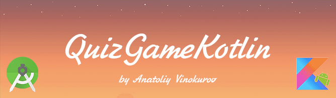
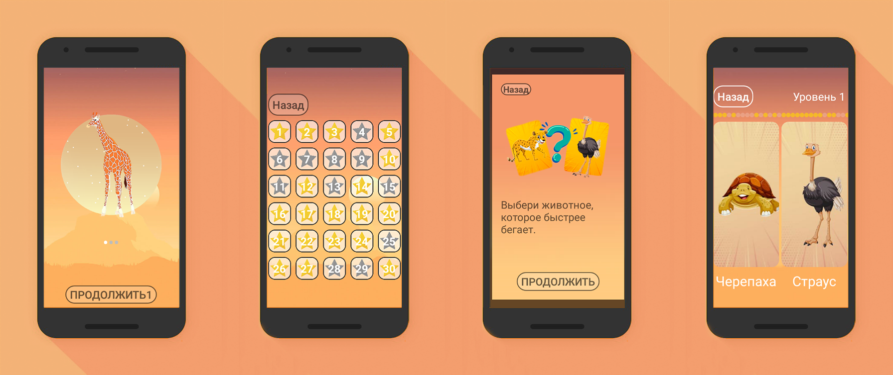
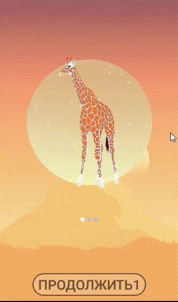
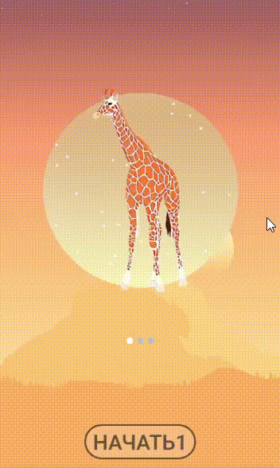
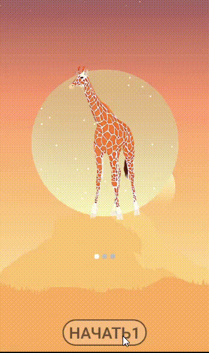

<h1 align="center"> QuizGameKotlin - Quiz about animals on Kotlin</h1>

## Description

Quiz about animals for children is designed to run on devices running the Android operating system version 4.4.2 (KitKat) and higher, written exclusively in Kotlin.

### Main menu

The main menu consists of slides with images of animals on it and a button at the bottom.

Slides can be whistled with your finger to select the level of the game.

Initially, only the first level of the game is available to the player. The remaining levels of the game are blocked and will be available as you progress through it.

Each level contains 30 tasks. The player starts the game with the first task and the rest will be opened as the game progresses. Successfully completed tasks are marked with a gold star. Failed tasks are marked with a gray star.

When you select a task, you will see a hint on how to play.
The game interface consists of two images: left and right. The player needs to select the correct option by clicking on the image. When you select the correct option a green check mark appears and the correct choice is displayed as a green dot at the top of the screen. If the answer is incorrect, a red cross is displayed, an incorrect selection is displayed as a red dot at the top of the screen.

Level 1

Level 2

Level 3

## Project setup

import this project to Android Studio

## Future scope

- Add translations to other languages.
- Add an activity with information.